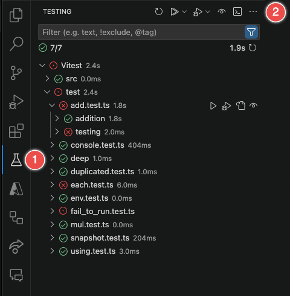
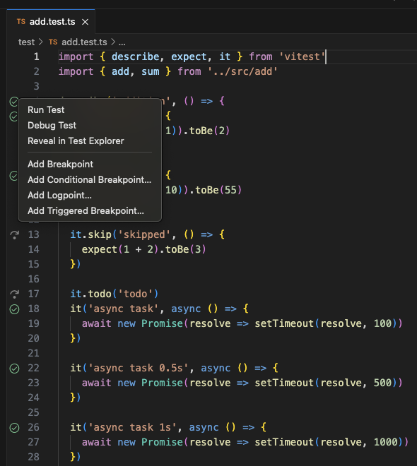
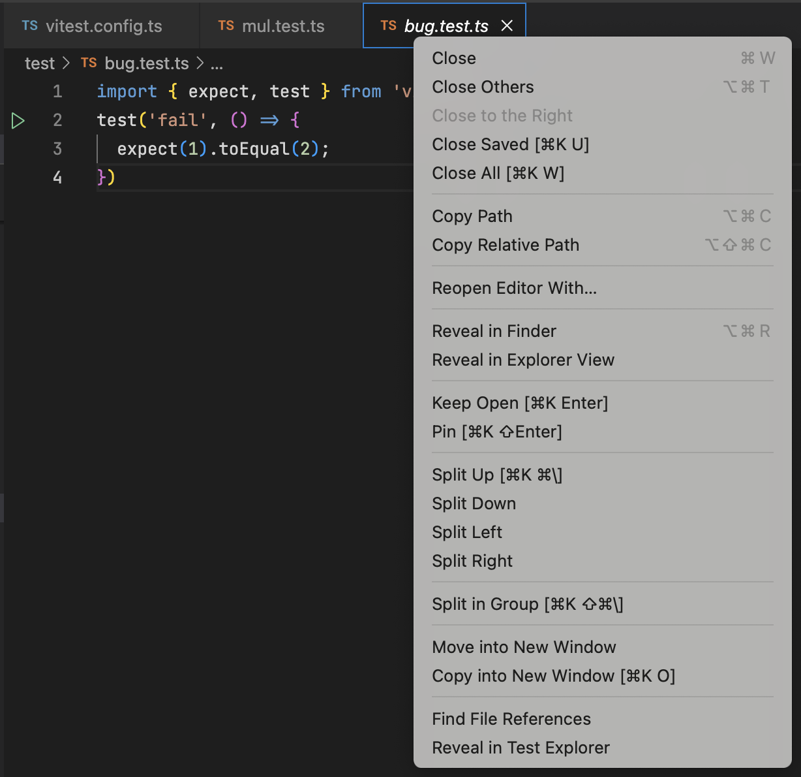
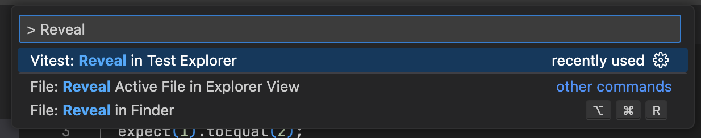

  

<h1 align="center">Vitest extension for Visual Studio Code. Available on <a href="https://marketplace.visualstudio.com/items?itemName=vitest.explorer">Visual Studio Marketplace</a>.</h1>

## Features

- **Run**, **debug**, and **watch** Vitest tests in Visual Studio Code.
- **Coverage** support (requires VS Code >= 1.88)
- NX support (see the [NX sample](./samples/monorepo-nx/)).
- An `@open` tag can be used when filtering tests, to only show the tests open in the editor.

## Requirements

- Visual Studio Code version >= 1.77.0
- Vitest version >= v1.4.0
- Node.js version >= 18.0.0 (follows Vitest)
- Coverage requires Visual Studio Code >= 1.88.0

## Usage

You can manage tests both from the Testing view and directly within your test files.

Vitest uses vscode's `TestController` API to provide a unified testing experience. You can read the official guide on how to run tests in the [VSCode Documentation](https://code.visualstudio.com/docs/editor/testing).

### In the Testing View

You can access the extension from the Testing view in the Visual Studio Code sidebar.

The toolbar at the top provides various commands to manage test execution:

- **Refresh Tests**: To reload your test suite, reflecting any new changes.
- **Run All Tests**: To start testing all cases that are currently visible.
- **Debug Tests**: To begin a debugging session for the tests.
- **Run Tests with Coverage**: To start testing all cases that are currently visible, while also collecting code coverage information.
- **Continuous Run/Stop Continuous Run**: To toggle the watch mode for running tests on file changes.
- **Show Output**: To display detailed logs from test executions.
- **Miscellaneous Settings**: To customize the Testing view, such as sorting and grouping tests.

> 💡 Hovering, or right clicking a folder, test file, test suite, or a test will reveal more actions.

The filter bar allows you to narrow down the tests displayed, focusing on specific tests by name, exclusion patterns, or tags.

Icons next to each test indicate their status—passed (checkmark), failed (cross), skipped (arrow), queued (yellow icon), or not executed (dot).

### In the Test File

When viewing a test file, you'll notice test icons in the gutter next to each test case:

- **Run a Single Test:** Click the test icon next to a test case to run that specific test.
- **More Options:** Right-click the test icon to open a context menu with additional options:
  - `Run Test`: Execute the selected test case.
  - `Debug Test`: Start a debugging session for the selected test case.
  - `Run with coverage`: Execute the selected test case while also collecting code coverage information.
  - `Reveal in Test Explorer`: Locate and highlight the test in the centralized Testing view.
  - `Breakpoint Settings`: Set breakpoints to pause execution during debugging. You can add a standard breakpoint, a conditional breakpoint, a logpoint, or a triggered breakpoint.

## Configuration

You can identify if your config is loaded by the extension with `process.env.VITEST_VSCODE` and change the configuration accordingly.

### Workspace Configurations

These options are resolved relative to the [workspace file](https://code.visualstudio.com/docs/editor/workspaces#_multiroot-workspaces) if there is one. If you have a single folder open in Visual Studio Code, paths will be resolved relative to that folder. If there are multiple folders, but there is no workspace file, then paths are resolved as is (so they should be absolute) - this can happen if you change your user config to have multiple folders.

- `vitest.rootConfig`: The path to your root config file. If you have several Vitest configs, consider using a [Vitest workspace](https://vitest.dev/guide/workspace).
- `vitest.workspaceConfig`: The path to the [Vitest workspace](https://vitest.dev/guide/workspace) config file. You can only have a single workspace config per VSCode workspace.
- `vitest.configSearchPatternExclude`: [Glob pattern](https://code.visualstudio.com/docs/editor/glob-patterns) that should be ignored when this extension looks for config files. Note that this is applied to _config_ files, not test files inside configs. Default: `{**/node_modules/**,**/.*/**,*.d.ts}`. If the extension cannot find Vitest, please open an issue.
- `vitest.shellType`: The method the extension uses to spawn a long-running Vitest process. This is particularly useful if you are using a custom shell script to set up the environment. When using the `terminal` shell type, the websocket connection will be established. Can either be `terminal` or `child_process`. Default: `child process`.
- `vitest.nodeExecutable`: The path to the Node.js executable. If not assigned, tries to find Node.js path via a PATH variable or a `which` command. This is applied only when `vitest.shellType` is `child_process` (the default).
- `vitest.nodeExecArgs`: The arguments to pass to the Node.js executable. This is applied only when `vitest.shellType` is `child_process` (the default).
- `vitest.terminalShellPath`: The path to the shell executable. This is applied only when `vitest.shellType` is `terminal`.
- `vitest.terminalShellArgs`: The arguments to pass to the shell executable. This is applied only when `vitest.shellType` is `terminal`.
- `vitest.debuggerPort`: Port that the debugger will be attached to. By default uses 9229 or tries to find a free port if it's not available.
- `vitest.debuggerAddress`: TCP/IP address of process to be debugged. Default: localhost

> 💡 The `vitest.nodeExecutable` and `vitest.nodeExecArgs` settings are used as `execPath` and `execArgv` when spawning a new `child_process`, and as `runtimeExecutable` and `runtimeArgs` when [debugging a test](https://github.com/microsoft/vscode-js-debug/blob/main/OPTIONS.md).
> The `vitest.terminalShellPath` and `vitest.terminalShellArgs` settings are used as `shellPath` and `shellArgs` when creating a new [terminal](https://code.visualstudio.com/api/references/vscode-api#Terminal)

### Other Options

- `vitest.filesWatcherInclude`: Glob pattern for the watcher that triggers a test rerun or collects changes. Default: `**/*`
- `vitest.vitestPackagePath`: The path to a `package.json` file of a Vitest executable (it's usually inside `node_modules`) in case the extension cannot find it. It will be used to resolve Vitest API paths. This should be used as a last resort fix.
- `vitest.nodeEnv`: Environment passed to the runner process in addition to
  `process.env`
- `vitest.debugExclude`: Excludes files matching specified glob patterns from debugging. Default:
  `[\"<node_internals>/**\", \"**/node_modules/**\"]`
- `vitest.maximumConfigs`: The maximum amount of configs that Vitest extension can load. If exceeded, the extension will show a warning suggesting to use a workspace config file. Default: `3`
- `vitest.logLevel`: How verbose should the logger be in the "Output" channel. Default: `info`

### Commands

You can reveal the current test file in the test explorer view by selecting the "Reveal in Test Explorer" option (the last option on the screenshot) in the file context:

You can also type the same command in the quick picker while the file is open.

### Experimental

If the extension hangs, consider enabling `vitest.experimentalStaticAstCollect` option to use static analysis instead of actually running the test file every time you make a change which can cause visible hangs if it takes a long time to setup the test.

## FAQs (Frequently Asked Questions)

### How can I use it in monorepo?

See <https://vitest.dev/guide/workspace.html> for monorepo support.

### How to hide Test Results view when running tests

You can change the behaviour of testing view by modifying `testing.openTesting` option:

- `neverOpen` will never open the testing view
- `openOnTestStart` (default) opens the test results view when test starts running
- `openOnTestFailure` opens the test results view if at least one of test fails
- `openExplorerOnTestStart`  will open the test tree view when tests starts

This is a vscode's built-in option and will control every plugin.

### I am using `vitest.shellType: terminal`, but I don't see the terminal

The extension uses a modified Vitest script that removes the reporter output. For this reason, the terminal is hidden by default. However, it might be useful to debug issues with the extension or Vitest itself - to open the terminal in the "Terminals" view you can use the "Vitest: Show Shell Terminal" command.
